# literature-review-hardened

A Claude Code skill for writing academic **literature reviews** under a **"verify-first, never fabricate"** regime — so the AI cites only real, checkable sources.
撰寫學術**文獻綜述**的 Claude Code skill，核心是「**先查證、再寫作，嚴禁捏造引用**」。

> ⚠️ Covers the **literature review** only (a review section, or a standalone narrative review/survey). Not Methods/Results/Discussion, and not a substitute for a formal PRISMA systematic review or meta-analysis.

## Workflow

Verify-first: nothing is written until each claim's citation clears the verification layer.

```mermaid
flowchart TD
    A[Define question &amp; scope] --> B[Retrieve real sources<br/>with tools, not memory]
    B --> C[Evaluate &amp; outline claims]
    C --> D[For EACH claim–citation pair:<br/>Citation Verification Layer]
    D --> E{&#9312; exists? &#9313; DOI resolves?<br/>&#9314; retraction? &#9315; red-flag?<br/>each needs a &#9317; tool-return}
    E -->|no| R[REJECTED → audit log]
    E -->|yes| F{&#9316; supports THIS claim?<br/>locator + greppable excerpt}
    F -->|not checked| U1[SUPPORT_UNCONFIRMED]
    F -->|no support| U2[UNSUPPORTED]
    F -->|yes| S[SUPPORTED ✅]
    S --> G[Write body using ONLY ✅ pairs]
    G --> H[Deliver: review + References ✅<br/>+ Verification Table + appendix]
    R -.-> H
    U1 -.-> H
    U2 -.-> H
```



## Anti-hallucination mechanism / 防範幻覺機制

The unit of verification is the **claim–citation pair**. Key gates:

- **Mandatory grounding** — retrieve with tools before writing, never from memory.
- **Evidence-or-it-didn't-happen** — every check (existence, DOI resolve, support) needs a captured tool-return; no record ⇒ stays `CANDIDATE`.
- **Existence ≠ support** — catches "real paper, fabricated claim" via an exact locator + greppable excerpt.
- **Stated vs. interpreted** — source claims need a backing locator; analyst inference is marked, never disguised as the source.
- **Uncertain ⇒ blank** — no source means `[needs-retrieval/unverified]`, never an invented one.

Only `SUPPORTED` pairs enter the body and References; the rest carry an in-text marker or stay in the audit log:

| Status | In-text marker | Body? |
|---|---|---|
| `SUPPORTED` | *(real citation)* | ✅ |
| `CANDIDATE` / `REJECTED` | `[needs-retrieval/unverified]` | ❌ |
| `SUPPORT_UNCONFIRMED` | `[support-unconfirmed/recheck]` | ❌ |
| `UNSUPPORTED` | `[source-does-not-support/recheck]` | ❌ |

> **Honest ceiling / 根本極限:** the audit trail is self-reported by the same model that writes the prose, so it can be fabricated too. No wording closes this. The skill makes fabrication costly and auditable — **not** a guarantee of truth. Keep every entry a replayable artifact and human-spot-check the links.

## Install & use

```bash
mkdir -p ~/.claude/skills/literature-review-hardened
cp SKILL.md ~/.claude/skills/literature-review-hardened/
```
Restart Claude Code, then: *"Help me write a literature review on **[topic]**."*

## Attribution & license

Derived from `brycewang-stanford/Auto-Empirical-Research-Skills` skill 36 (`literature-review` / taoyunudt, MIT) — domain-specific examples, SCI-Hub, and the "lower plagiarism-rate" wording removed; all anti-hallucination machinery added. Verification borrows from `academic-paper-digest` and `literature-single-paper-decompose`. **MIT** — see [LICENSE](LICENSE).
