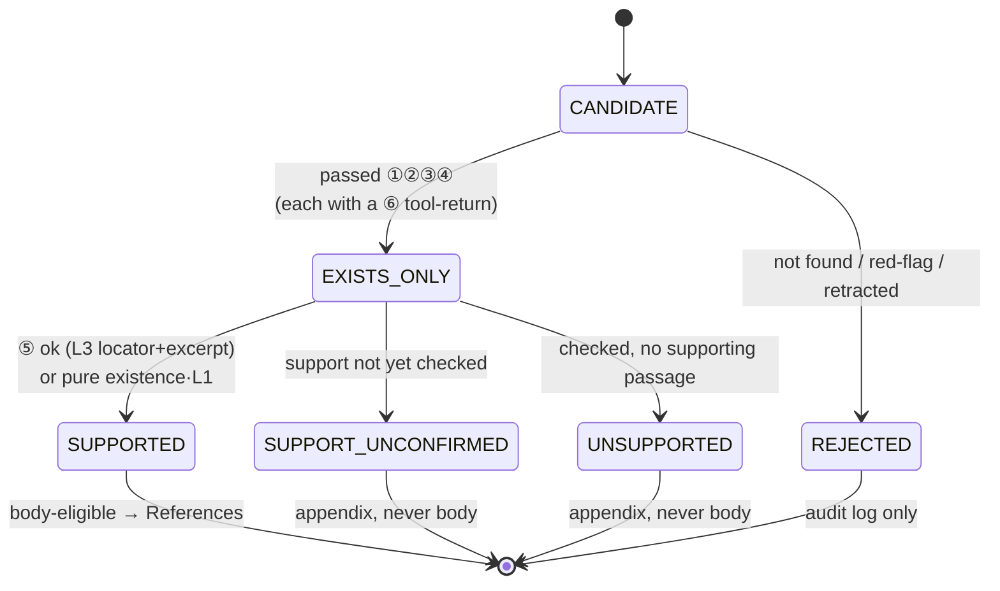

# literature-review-hardened

A Claude Code skill for writing academic **literature reviews** under a strict **"verify-first, never fabricate"** regime. It keeps a proven five-step methodology backbone but adds layered **anti-hallucination** machinery so the AI cites only real, checkable sources.

一個用於撰寫學術**文獻綜述**的 Claude Code skill，核心是「**先查證、再寫作，嚴禁捏造引用**」。保留標準五步法骨架，並加上分層**防幻覺**機制，讓 AI 只引用真實、可稽核的來源。

> ⚠️ **It targets one part of academic writing — the literature review** (the Literature Review / Related Work / Theoretical Framework section, or a standalone narrative review/survey). It does **not** cover Methods/Results/empirical Discussion, and does **not** replace a formal PRISMA systematic review or meta-analysis.

## Workflow / 流程圖

The skill runs **verify-first**: nothing is written until each claim's citation has cleared the verification layer.

```mermaid
flowchart TD
    A[Define question &amp; scope<br/>定題與範圍] --> B[Mandatory retrieval<br/>用真實工具檢索, 不靠記憶]
    B --> C[Evaluate &amp; select sources<br/>評估與選取]
    C --> D[Outline the claims<br/>列出每個論點]
    D --> E[For EACH claim–citation pair:<br/>run Citation Verification Layer<br/>逐筆 claim 跑查證層]
    E --> F{&#9312; exists? &#9313; DOI resolves?<br/>&#9314; retraction? &#9315; red-flag?<br/>each needs a &#9317; tool-return}
    F -->|no record / not found| R[REJECTED → off body<br/>進 audit log]
    F -->|yes| G{&#9316; supports THIS claim?<br/>locator + greppable excerpt}
    G -->|not checked yet| U1[SUPPORT_UNCONFIRMED]
    G -->|checked, no support| U2[UNSUPPORTED]
    G -->|yes| S[SUPPORTED ✅]
    S --> H[Write body using ONLY ✅ pairs<br/>正文只用已查證對齊的引用]
    H --> I[Final self-check:<br/>scan every in-text citation form]
    I --> J[Deliver: review + References ✅ only<br/>+ Claim–Citation Verification Table<br/>+ Open verification issues appendix]
    R -.-> J
    U1 -.appendix.-> J
    U2 -.appendix.-> J
```



## Anti-hallucination mechanism / 防範幻覺機制

Hallucination is intercepted by **multiple independent gates**; a citation reaches the body only after clearing all of them.

| # | Defense line | Intercepts | Mechanism |
|---|---|---|---|
| 1 | Mandatory grounding | Inventing bibliography from memory | Retrieve real sources with tools before writing |
| 2 | Existence check | Fake bibliography / wrong DOI | ①② — title·author·year·venue + **actually resolve** the DOI/ID |
| 3 | Retraction / red-flag screen | Citing retracted work, AI-chat links, predatory journals | ③④ |
| 4 | Claim-to-citation alignment | **Real paper, fabricated claim** (most subtle) | ⑤ — exact locator + greppable excerpt, else not cited |
| 5 | Citation-drift guard | Wrong paper / preprint↔published / versions | Pin a unique ID (DOI/PMID/arXiv/ISBN/URL) |
| 6 | Stated vs. interpreted split | Passing model inference off as the source's words | "Stated" needs a backing locator; interpretation marked explicitly |
| 7 | Over-claim gate | Over-linear causal chains, absolute claims | Qualify scope/conditions, else `[scope-unclear/recheck]` |
| 8 | Uncertain → leave blank | Filling gaps with plausible fabrication | No source ⇒ `[needs-retrieval/unverified]`, never invent |
| 9 | **Evidence-or-it-didn't-happen** | Claiming "verified" without doing it | Every check needs a captured ⑥ tool-return; no record ⇒ stays `CANDIDATE` |
| 10 | Pre-submission full scan | Stray placeholders, unaligned citations | Reconcile every in-text citation against the table |

### Status state machine / 狀態機

The unit of verification is the **claim–citation pair**. Only `SUPPORTED` may enter the body and References; everything else is parked with an in-text marker or in the audit log.



| Status | In-text marker | Body-eligible? |
|---|---|---|
| `SUPPORTED` | *(none — real citation)* | ✅ yes |
| `CANDIDATE` | `[needs-retrieval/unverified]` | ❌ |
| `EXISTS_ONLY` (content claim) | `[support-unconfirmed/recheck]` | ❌ (relabel to SUPPORTED first) |
| `SUPPORT_UNCONFIRMED` | `[support-unconfirmed/recheck]` | ❌ |
| `UNSUPPORTED` | `[source-does-not-support/recheck]` | ❌ |
| `REJECTED` | `[needs-retrieval/unverified]` | ❌ |

### Honest ceiling / 根本極限

The audit trail is **self-reported by the same model that writes the prose** — a model that can hallucinate a citation can hallucinate its evidence too. **No wording closes this.** The skill raises the cost of fabrication and makes it auditable; it is **not** a guarantee of truth. Always keep every audit-trail entry a **real, replayable artifact** and **human-spot-check** that the links truly open and contain the cited excerpt.

## Install

```bash
mkdir -p ~/.claude/skills/literature-review-hardened
cp SKILL.md ~/.claude/skills/literature-review-hardened/
```
Restart Claude Code or start a new conversation.

## Usage

> Help me write a literature review on **[your topic]**.

The skill will search first, verify each claim–citation pair, and deliver the review plus a Citation Verification Table (with any unresolved items moved to an "Open verification issues" appendix).

## Provenance & attribution

Derived from `brycewang-stanford/Auto-Empirical-Research-Skills`, skill 36 (`literature-review` / taoyunudt, MIT License). This version removes the original's domain-specific examples, the pirate source SCI-Hub, and "lower the plagiarism-check rate" wording, and adds all anti-hallucination machinery. Verification mechanisms borrow from the companion skills `academic-paper-digest` and `literature-single-paper-decompose`.

## License

MIT — see [LICENSE](LICENSE).
