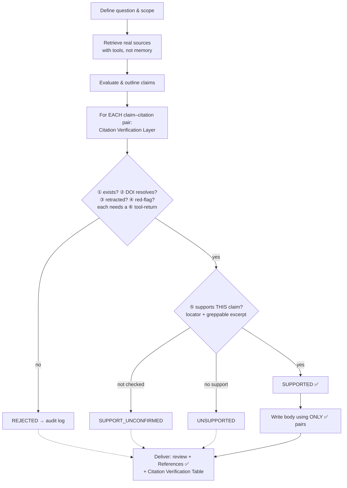

# literature-review-hardened

> A Claude Code skill for writing academic **literature reviews** under a **"verify-first, never fabricate"** regime — every citation is verified before the prose is written.
> 學術**文獻綜述**撰寫 skill，核心原則「**先查證、再寫作，嚴禁捏造引用**」——每一個論斷–引用對在進入正文前都要通過驗證閘門。

> ⚠️ Covers the **literature review** only (a review section, or a standalone narrative review). Not a substitute for a formal PRISMA systematic review or meta-analysis.

---

## What it does

- Retrieves sources with **tools**, not from memory
- Verifies each citation for existence, DOI resolution, retraction status, and support for the specific claim it's attached to
- Writes prose only from `SUPPORTED` citation–claim pairs
- Delivers the review body + a Citation Verification Table so every entry is auditable

---

## Workflow



---

## Anti-hallucination mechanism

The unit of verification is the **claim–citation pair** (not just "does this paper exist").

| Defense | What it blocks |
|---|---|
| **Mandatory grounding** | Sources are retrieved with tools (WebSearch, firecrawl, scholarly search) before writing — never from the model's memory |
| **Evidence-or-it-didn't-happen** | Each check (existence, DOI resolve, support) requires a captured tool-return. No record ⇒ stays `CANDIDATE`, never silently promoted |
| **Existence ≠ support** | The paper must actually support *this specific claim* at a locatable excerpt — not just "it's a real paper." Catches "real paper, fabricated claim." |
| **Stated vs. interpreted** | Source claims need an exact locator; analyst inference is labeled separately, never disguised as the source's words |
| **Uncertain ⇒ blank** | No source means `[needs-retrieval/unverified]`, not an invented citation |

Citation status flow:

| Status | In-text marker | Enters body? |
|---|---|---|
| `SUPPORTED` | *(real citation)* | ✅ |
| `CANDIDATE` / `REJECTED` | `[needs-retrieval/unverified]` | ❌ |
| `SUPPORT_UNCONFIRMED` | `[support-unconfirmed/recheck]` | ❌ |
| `UNSUPPORTED` | `[source-does-not-support/recheck]` | ❌ |

> **Honest ceiling:** the audit trail is produced by the same model that writes the prose, so it can still be fabricated. This skill makes fabrication costly and auditable — not impossible. Spot-check the links yourself for high-stakes reviews.

---

## File layout

```
literature-review-hardened/
├── SKILL.md                        Full workflow, Citation Verification Layer rules,
│                                   forbidden actions, structure templates
└── scripts/
    └── verify_refs.py              Crossref / doi.org verifier (pure stdlib)
```

---

## Quick start

```bash
git clone https://github.com/ganma0517/literature-review-hardened.git \
  ~/.claude/skills/literature-review-hardened
```

Restart Claude Code, then:

> *"Help me write a literature review on **[topic]**."*
> *"Write the related-work section of my paper on **[topic]**, verify all citations."*

---

## Dependencies

- `python3` for `scripts/verify_refs.py` (standard library only, no install needed)
- Web-search MCP (firecrawl or WebSearch) for source retrieval

---

## When to use / not use

**Use:** writing a literature review section, a standalone narrative review, or a related-work section where citation credibility matters.

**Don't use:** digesting a single paper → `academic-paper-digest`; forensic single-paper decomposition with verbatim quote grounding → `literature-single-paper-decompose`; full systematic review with PRISMA protocol; Methods / Results / Discussion sections.

---

## 中文摘要

本 skill 的核心原則：**每個「論斷–引用」對在進入正文前，都必須通過查證閘門**——確認文獻存在、DOI 有效、未撤稿，且**確實支持本文宣稱的論點**（非只是「這是一篇真實論文」）。查不到來源就標 `[needs-retrieval/unverified]`，不捏造。正文只用 `SUPPORTED` 配對撰寫；所有其他狀態留在查證表供人工覆核。

---

## Attribution & license

Derived from `brycewang-stanford/Auto-Empirical-Research-Skills` (MIT) — SCI-Hub references and "lower plagiarism-rate" wording removed; all verification machinery added. Borrows from `academic-paper-digest` and `literature-single-paper-decompose`. **MIT**
